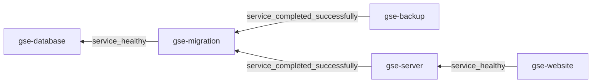

# GitHub Search &middot; [](http://seart-ghs.si.usi.ch) [](https://github.com/seart-group/ghs/blob/master/LICENSE) [](https://www.dropbox.com/scl/fi/hjr2dyiiw9tpwollvt0ob/gse.sql.gz?rlkey=tdzezhxpeqnaef5dwofzxj80m&dl=1) [](https://doi.org/10.5281/zenodo.4588464)

This project is made of two components:
1. A Spring Boot powered back-end, responsible for:
    1. Continuously crawling GitHub API endpoints for repository information, and storing it in a central database;
    2. Acting as an API for providing access to the stored data.
2. A Bootstrap-styled and jQuery powered web user interface, serving an accessible front for the API, available at http://seart-ghs.si.usi.ch

## Running Locally

### Prerequisites

| Dependency                               | Version Requirement |
|------------------------------------------|--------------------:|
| Java                                     |                  11 |
| Maven                                    |               3.8.6 |
| MySQL                                    |              8.0.33 |
| Flyway                                   |              9.21.1 |
| Git                                      |              2.25.2 |
| [cloc](https://github.com/AlDanial/cloc) |                1.96 |

### Database

Before choosing whether to start with a clean slate or pre-populated database, make sure the following requirements are met:

1. The database timezone is set to `+00:00`. You can verify this via:

    ```sql
    SELECT @@global.time_zone, @@session.time_zone;
    ```

2. The event scheduler is turned `ON`. You can verify this via:

   ```sql
   SELECT @@global.event_scheduler;
   ```

3. The `gse` database exists. To create it:

    ```sql
    CREATE DATABASE gse CHARACTER SET utf8 COLLATE utf8_bin;
    ```

4. The `gseadmin` user exists. To create one, run:

    ```sql
    CREATE USER IF NOT EXISTS 'gseadmin'@'%' IDENTIFIED BY 'Lugano2020';
    GRANT ALL ON gse.* TO 'gseadmin'@'%';
    ```

If you want to start with a completely blank database, then no further action is required.
The necessary tables will be created by virtue of Flyway migrations, which will run on initial server startup.
However, if you want your local database to be pre-initialized with the data we have mined, then you can use the compressed SQL dump we provide.
We host said dump on [Dropbox](https://www.dropbox.com/scl/fi/hjr2dyiiw9tpwollvt0ob/gse.sql.gz?rlkey=tdzezhxpeqnaef5dwofzxj80m&dl=1), and after downloading, you can import the data by running:

```shell
gzcat < gse.sql.gz | mysql -u gseadmin -pLugano2020 gse
```

### Server

Before attempting to run the server, I advise you generate your own GitHub personal access token (PAT).
Said token should include the `repo` scope, in order for it to effectively crawl the GitHub API.
While the token is not mandatory, the impact its presence has on the mining speed can not be understated.

Once that is done, you can run the server locally using Maven:

```shell
mvn spring-boot:run
```

If you want to make use of the token when crawling, specify it in the run arguments:

```shell
mvn spring-boot:run -Dspring-boot.run.arguments=--app.crawl.tokens=<your_access_token>
```

Alternatively, you can compile and run the JAR directly:

```shell
mvn clean package
ln target/ghs-application-*.jar target/ghs-application.jar
java -Dapp.crawl.tokens=<your_access_token> -jar target/ghs-application.jar
```

Here's a list of project-specific arguments supported by the application that you can find in the `application.properties`:

| Variable Name                         | Type               | Default Value                                                           | Description                                                                                                                                                           |
|---------------------------------------|--------------------|-------------------------------------------------------------------------|-----------------------------------------------------------------------------------------------------------------------------------------------------------------------|
| `app.crawl.enabled`                   | Boolean            | true                                                                    | Specifies if the crawling jobs are enabled on startup                                                                                                                 |
| `app.crawl.minimum-stars`             | Integer            | 10                                                                      | Inclusive lower bound for the number of stars a project needs to have in order to be picked up by the crawler                                                         |
| `app.crawl.languages`                 | List&lt;String&gt; | See [application.properties](src/main/resources/application.properties) | A comma-separated list of language names that will be targeted during crawling                                                                                        |
| `app.crawl.tokens`                    | List&lt;String&gt; |                                                                         | A comma-separated list of GitHub personal access tokens (PATs) that will be used for mining the GitHub API                                                            |
| `app.crawl.scheduling`                | String             | PT6H                                                                    | Crawler scheduling rate, expressed as a duration string                                                                                                               |
| `app.crawl.startdate`                 | String             | 2008-01-01T00:00:00                                                     | "Beginning of time". Basically the earliest supported date for crawling repos, if no crawl jobs were previously performed. Formatted as a yyyy-MM-ddTHH:MM:SS string. |
| `app.crawl.analysis.enabled`          | Boolean            | true                                                                    | Specifies if the analysis job is enabled on startup                                                                                                                   |
| `app.crawl.analysis.scheduling`       | String             | PT6H                                                                    | Analysis job scheduling rate, expressed as a duration string                                                                                                          |
| `app.crawl.analysis.folder-prefix`    | String             | ghs-cloned-                                                             | The prefix used for the names of the folders where Git repositories are cloned                                                                                        |
| `app.crawl.analysis.max-pool-threads` | Integer            | 3                                                                       | The maximum amount of live threads dedicated to cloning git repositories, expressed as a numeric string                                                               |
| `app.cleanup.enabled`                 | Boolean            | true                                                                    | Specified if the job responsible for removing unavailable repositories is enabled on startup                                                                          |
| `app.cleanup.cron`                    | String             | 0 0 0 * * 1                                                             | Cleanup scheduling rate, as a [Spring CRON expression](https://spring.io/blog/2020/11/10/new-in-spring-5-3-improved-cron-expressions)                                 |
| `app.statistics.suggestion-limit`     | Integer            | 500                                                                     | The maximum number of suggestions that will be made available to the UI autocompletion fields                                                                         |

### Web UI

The easiest way to start the front-end is through IntelliJ's built-in web server.
After starting the application back-end right click on `index.html` in the [html](html) directory,
and select one of the provided launch options from `Open In > Browser`.
Alternatively, you can self-host the web UI by virtue of tools such as `http-server`:

```shell
# install by running: npm install -g http-server
http-server html -p 3030
```

Regardless of which method you choose for hosting, the back-end CORS restricts you to using either port `3030` or `7030`.

## Dockerisation :whale:

The deployment stack consists of the following containers:

| Service/Container name |                                Image                                 | Purpose                           |      Enabled by Default       |
|------------------------|:--------------------------------------------------------------------:|-----------------------------------|:-----------------------------:|
| `gse-database`         |           [mysql](https://registry.hub.docker.com/_/mysql)           | for the database                  |      :white_check_mark:       |
| `gse-migration`        |      [flyway](https://registry.hub.docker.com/r/flyway/flyway)       | for the schema migrations         |      :white_check_mark:       |
| `gse-backup`           | [tiredofit/db-backup](https://hub.docker.com/r/tiredofit/db-backup/) | for the automatic backups         | :negative_squared_cross_mark: |
| `gse-server`           |               [gse/backend](docker/server/Dockerfile)                | for the spring application itself |      :white_check_mark:       |
| `gse-website`          |              [gse/frontend](docker/website/Dockerfile)               | for supplying the front-end files |      :white_check_mark:       |

The service dependency chain can be represented as follows:



Deploying is as simple as, in the [docker-compose](docker-compose) directory, run:

```shell
docker-compose -f docker-compose.yml up -d
```

It's worth mentioning that the database setup steps outlined in the previous section are not needed when running with docker,
as the environment properties passed to the service will create the user and DB on first ever startup.
However, the same does not apply to the database data, as the default deployment will create an empty database.
If you want to use existing data from the dumps, then you have to override the compose deployment to use a custom database image that comes bundled with the dump.
Create your `docker-compose.override.yml` file, and add to it the following contents:

```yaml
version: '3.9'
name: 'gse'

services:

  gse-db:
    build:
      context: ../
      dockerfile: docker/database/Dockerfile
    image: 'gse/database:latest'
```

When deploying, you will need to specify the override file:

```shell
docker-compose -f docker-compose.yml -f docker-compose.override.yml up -d
```

The database data itself is kept in the `gse-data` volume, while detailed back-end logs are kept in a local mount called [logs](docker-compose/logs).

You can also use this override file to change the configurations of other services, for instance specifying your own PAT for the crawler:

```yaml
version: '3.9'
name: 'gse'

services:

  # other services omitted...

  gse-app:
    environment:
      APP_CRAWL_ENABLED: 'true'
      APP_CRAWL_TOKENS: '<your_access_token>'
```

Any of the Spring Boot properties or aforementioned application-specific properties can be overridden.
Just keep in mind that `app.x.y` corresponds to the `APP_X_Y` service environment setting.

Another example is the automated database backup service, which is disabled by default.
Should you chose to re-enable it, you would have to add the following to the override file:

```yaml
version: '3.9'
name: 'gse'

services:

  # other services omitted...

  gse-bkp:
    restart: always
    entrypoint: "/init"
```

---

## FAQ

### How can I report a bug or request a feature or ask a question?

Please add a [new issue](https://github.com/seart-group/ghs/issues/), and we will get back to you very soon.

### How do I extend/modify the existing database schema?

In order to do that, you should be familiar with database migration tools and practices.
This project in particular uses [Flyway](https://flywaydb.org/) by Redgate.
However, the general rule for schema manipulation is: create new migrations, and _do not_ edit existing ones.
