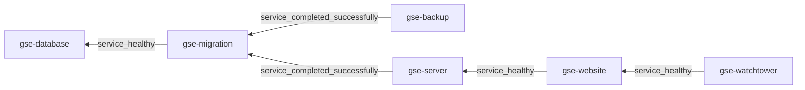

# GitHub Search &middot; [](http://seart-ghs.si.usi.ch) [](https://github.com/seart-group/ghs/blob/master/LICENSE) [](https://www.dropbox.com/scl/fi/mrdf1vbd5grb2nml1s99z/gse.sql.gz?rlkey=lmtpmvdlkuia0g7rlill6a0ks&st=a8s41gzx&dl=1) [](https://doi.org/10.5281/zenodo.4588464) <!-- markdownlint-disable-line -->

This project is made of two components:

1. A Spring Boot powered back-end, responsible for:
    1. Continuously crawling GitHub API endpoints for repository information, and storing it in a central database;
    2. Acting as an API for providing access to the stored data.
2. A Bootstrap-styled and jQuery-powered web user interface, serving as an accessible front for the API, available
   [here](http://seart-ghs.si.usi.ch).

## Running Locally

### Prerequisites

| Dependency                               | Version Requirement |
|------------------------------------------|--------------------:|
| Java                                     |                  17 |
| Maven                                    |                 3.9 |
| MySQL                                    |                 8.3 |
| Flyway                                   |               10.13 |
| Git                                      |                2.43 |
| [curl](https://github.com/curl/curl)     |                 8.5 |
| [cloc](https://github.com/AlDanial/cloc) |                1.98 |

### Database

Before choosing whether to start with a clean slate or pre-populated database,
make sure the following requirements are met:

1. The database timezone is set to `+00:00`. You can verify this via:

    ```sql
    SELECT @@global.time_zone, @@session.time_zone;
    ```

2. The event scheduler is turned `ON`. You can verify this via:

   ```sql
   SELECT @@global.event_scheduler;
   ```

3. The binary logging during the creation of stored functions is set to `1`. You can verify this via:

    ```sql
    SELECT @@global.log_bin_trust_function_creators;
    ```

4. The `gse` database exists. To create it:

    ```sql
    CREATE DATABASE gse CHARACTER SET utf8 COLLATE utf8_bin;
    ```

5. The `gseadmin` user exists. To create one, run:

    ```sql
    CREATE USER IF NOT EXISTS 'gseadmin'@'%' IDENTIFIED BY 'Lugano2020';
    GRANT ALL ON gse.* TO 'gseadmin'@'%';
    ```

If you prefer to begin with an empty database, there's nothing more for you to do.
The required tables will be generated through Flyway migrations during the initial startup of the server.
However, if you'd like your local database to be pre-populated with the data we've collected,
you can utilize the compressed SQL dump we offer. We host this dump, along with the four previous iterations,
on [Dropbox](https://www.dropbox.com/scl/fo/lqvp1mhsg0ezp2sgs0xdk/h?rlkey=j9joij3iqpy1zl5h061vdnlj6).
After choosing and downloading a database dump, you can import the data by executing:

```shell
gzcat < gse.sql.gz | mysql -u gseadmin -pLugano2020 gse
```

### Server

Before attempting to run the server, you must generate your own GitHub personal access token (PAT).
GHS relies on the GraphQL API, which is inaccessible without authentication.
To access the information provided by the GitHub API, the token must include the `repo` scope.

Once that is done, you can run the server locally using Maven:

```shell
mvn spring-boot:run
```

If you want to make use of the token when crawling, specify it in the run arguments:

```shell
mvn spring-boot:run -Dspring-boot.run.arguments=--ghs.github.tokens=<your_access_token>
```

Alternatively, you can compile and run the JAR directly:

```shell
mvn clean package
ln target/ghs-application-*.jar target/ghs-application.jar
java -Dghs.github.tokens=<your_access_token> -jar target/ghs-application.jar
```

Here's a list of project-specific arguments supported by the application that you can find in the `application.properties`:

| Variable Name                        | Type               | Default Value                                                           | Description                                                                                                                                                                                                                                                        |
|--------------------------------------|--------------------|-------------------------------------------------------------------------|--------------------------------------------------------------------------------------------------------------------------------------------------------------------------------------------------------------------------------------------------------------------|
| `ghs.github.tokens`                  | List&lt;String&gt; |                                                                         | List of [GitHub personal access tokens (PATs)](https://docs.github.com/en/authentication/keeping-your-account-and-data-secure/managing-your-personal-access-tokens) that will be used for mining the GitHub API. Must not contain blank strings.                   |
| `ghs.github.api-version`             | String             | 2022-11-28                                                              | [GitHub API version](https://docs.github.com/en/rest/overview/api-versions) used across various operations.                                                                                                                                                        |
| `ghs.git.folder-prefix`              | String             | ghs-clone-                                                              | Prefix used for the temporary directories into which analyzed repositories are cloned. Must not be blank.                                                                                                                                                          |
| `ghs.git.clone-timeout-duration`     | Duration           | 5m                                                                      | Maximum time allowed for cloning Git repositories.                                                                                                                                                                                                                 |
| `ghs.cloc.analysis-timeout-duration` | Duration           | 5m                                                                      | Maximum time allowed for analyzing cloned Git repositories with `cloc`.                                                                                                                                                                                            |
| `ghs.curl.connect-timeout-duration`  | Duration           | 1m                                                                      | Maximum time allowed for establishing HTTP connections with `curl`.                                                                                                                                                                                                |
| `ghs.crawler.enabled`                | Boolean            | true                                                                    | Specifies if the repository crawling job is enabled.                                                                                                                                                                                                               |
| `ghs.crawler.minimum-stars`          | int                | 10                                                                      | Inclusive lower bound for the number of stars a project needs to have in order to be picked up by the crawler. Must not be negative.                                                                                                                               |
| `ghs.crawler.languages`              | List&lt;String&gt; | See [application.properties](src/main/resources/application.properties) | List of language names that will be targeted during crawling. Must not contain blank strings. To ensure proper operations, the names must match those specified in [linguist](https://github.com/github-linguist/linguist/blob/master/lib/linguist/languages.yml). |
| `ghs.crawler.start-date`             | Date               | 2008-01-01T00:00:00Z                                                    | Default crawler start date: the earliest date for repository crawling in the absence of prior crawl jobs. Value format: `yyyy-MM-ddTHH:MM:SSZ`.                                                                                                                    |
| `ghs.crawler.delay-between-runs`     | Duration           | PT6H                                                                    | Delay between successive crawler runs, expressed as a duration string.                                                                                                                                                                                             |
| `ghs.analysis.enabled`               | Boolean            | true                                                                    | Specifies if the analysis job is enabled.                                                                                                                                                                                                                          |
| `ghs.analysis.delay-between-runs`    | Duration           | PT6H                                                                    | Delay between successive analysis runs, expressed as a duration string.                                                                                                                                                                                            |
| `ghs.analysis.max-pool-threads`      | int                | 3                                                                       | Maximum amount of live threads dedicated to concurrently analyzing repositories. Must be positive.                                                                                                                                                                 |
| `ghs.clean-up.enabled`               | Boolean            | true                                                                    | Specifies if the job responsible for removing unavailable repositories (clean-up) is enabled.                                                                                                                                                                      |
| `ghs.clean-up.cron`                  | CronTrigger        | 0 0 0 \* \* 1                                                           | Delay between successive repository clean-up runs, expressed as a [Spring CRON expression](https://spring.io/blog/2020/11/10/new-in-spring-5-3-improved-cron-expressions).                                                                                         |

### Web UI

The easiest way to launch the front-end is through the provided NPM script:

```shell
npm run dev
```

You can also use the built-in web server of your IDE, or any other web server of your choice.
Regardless of which method you choose for hosting, the back-end CORS restricts you to using ports `3030` and `7030`.

## Dockerisation :whale:

The deployment stack consists of the following containers:

| Service/Container name |                                  Image                                  | Description                              |      Enabled by Default       |
|------------------------|:-----------------------------------------------------------------------:|------------------------------------------|:-----------------------------:|
| `gse-database`         |            [mysql](https://registry.hub.docker.com/_/mysql)             | Platform database                        |      :white_check_mark:       |
| `gse-migration`        |        [flyway](https://registry.hub.docker.com/r/flyway/flyway)        | Database schema migration executions     |      :white_check_mark:       |
| `gse-backup`           |  [tiredofit/db-backup](https://hub.docker.com/r/tiredofit/db-backup/)   | Automated database backups               | :negative_squared_cross_mark: |
| `gse-server`           |              [seart/ghs-server](docker/server/Dockerfile)               | Spring Boot server application           |      :white_check_mark:       |
| `gse-website`          |             [seart/ghs-website](docker/website/Dockerfile)              | NGINX web server acting as HTML supplier |      :white_check_mark:       |
| `gse-watchtower`       | [containrrr/watchtower](https://hub.docker.com/r/containrrr/watchtower) | Automatic Docker image updates           | :negative_squared_cross_mark: |

The service dependency chain can be represented as follows:



Deploying is as simple as, in the [docker-compose](docker-compose) directory, run:

```shell
docker-compose -f docker-compose.yml up -d
```

It's important to note that the database setup steps explained in the preceding section are unnecessary when running
with Docker. This is because the environment properties passed to the service will automatically establish the MySQL
user and database during the initial startup. However, this convenience does not extend to the database data, as the
default deployment generates an empty database. If you wish to utilize existing data from the dumps, you'll need to
override the compose deployment to employ a custom database image that includes the dump. To do this, create your
`docker-compose.override.yml` file with the following contents:

```yaml
version: '3.9'
name: 'gse'

services:

  gse-database:
     image: seart/ghs-database:latest
```

The above image will include the freshest database dump, at most 15 days behind the actual platform data.
For a more specific database version, refer to the [Docker Hub page](https://hub.docker.com/r/seart/ghs-database/tags).
Just remember to specify the override file during deployment:

```shell
docker-compose -f docker-compose.yml -f docker-compose.override.yml up -d
```

The database data itself is kept in the `gse-data` volume, while detailed back-end logs are kept in a local mount called
[logs](docker-compose/logs). You can also use this override file to change the configurations of other services, for
instance specifying your own PAT for the crawler:

```yaml
version: '3.9'
name: 'gse'

services:

  # other services omitted...

  gse-server:
    environment:
      GHS_GITHUB_TOKENS: 'A single or comma-separated list of token(s)'
      GHS_CRAWLER_ENABLED: 'true'
```

Any of the Spring Boot properties or aforementioned application-specific properties can be overridden.
Just keep in mind, that the `ghs.x.y` property corresponds to the `GHS_X_Y` service environment setting.

Another example is the automated database backup service, which is disabled by default.
Should you choose to re-enable it, you would have to add the following to the override file:

```yaml
version: '3.9'
name: 'gse'

services:

  # other services omitted...

  gse-backup:
    restart: always
    entrypoint: "/init"
```

Finally, configurations for some programs are stored within files that are added to services through bind mounts.
For instance, the Git configuration file is stored in the [git](docker-compose/git) directory.
If you want to further customize it in deployment (i.e. specify an alternative user agent),
you can create your own `.override.gitconfig`, and add the following to the override file:

```yaml
version: '3.9'
name: 'gse'

services:

  # other services omitted...

  gse-server:
    volumes:
      - ./git/.override.gitconfig:/root/.gitconfig
```

## FAQ

### How can I request a feature or ask a question?

If you have ideas for a feature you would like to see implemented or if you have any questions, we encourage you to
create a new [discussion](https://github.com/seart-group/ghs/discussions/). By initiating a discussion, you can engage
with the community and our team, and we'll respond promptly to address your queries or consider your feature requests.

### How can I report a bug?

To report any issues or bugs you encounter, please create a [new issue](https://github.com/seart-group/ghs/issues/).
Providing detailed information about the problem you're facing will help us understand and address it more effectively.
Rest assured, we are committed to promptly reviewing and responding to the issues you raise, working collaboratively
to resolve any bugs and improve the overall user experience.

### How do I contribute to the project?

Please refer to [CONTRIBUTING.md](CONTRIBUTING.md) for more information.

### How do I extend/modify the existing database schema?

To do that you should be familiar with database migration tools and practices.
This project in particular uses [Flyway](https://flywaydb.org/) by Redgate.
However, the general rule for schema manipulation is: create new migrations, and _do not_ edit existing ones.
